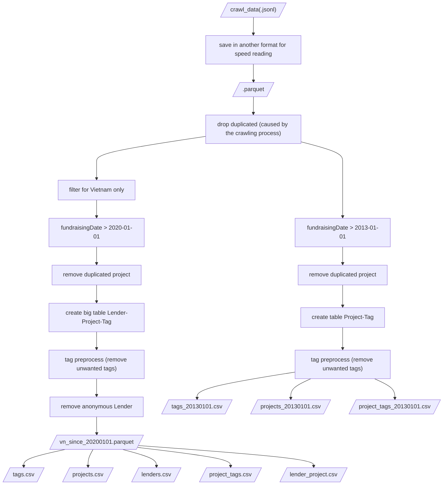

# Preprocess

```mermaid
graph TD
raw[/"crawl_data(.jsonl)"/] 
--> a["save in another format for speed reading"]
--> par[/".parquet"/]
--> b["drop duplicated (caused by the crawling process)"]
---> c["filter for Vietnam only"]
--> d["fundraisingDate > 2020-01-01"]
--> e["remove duplicated project"]
--> f["create big table Lender-Project-Tag"]
--> g["tag preprocess (remove unwanted tags)"]
--> h["remove anonymous Lender"]
--> vn[/"vn_since_20200101.parquet"/]
--> t[/"tags.csv"/]
vn --> pro[/"projects.csv"/]
vn --> lender[/"lenders.csv"/]
vn --> pt[/"project_tags.csv"/]
vn --> lp[/"lender_project.csv"/]

b ----> C["fundraisingDate > 2013-01-01"]
--> D["remove duplicated project"]
--> E["create table Project-Tag"]
--> G["tag preprocess (remove unwanted tags)"]
G --> T[/"tags_20130101.csv"/]
G --> PRO[/"projects_20130101.csv"/]
G --> PT[/"project_tags_20130101.csv"/]
```
